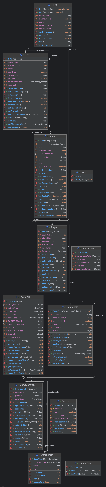

## **L'ACCADEMIA DEGLI ARCANI PERDUTI**

### INDICE

1. Descrizione
2. Progettazione
3. Diagramma delle Classe
4. Specifica Algebrica
5. Dettagli Implementativi

### 1. Descrizione

**Trama**

Quest'avventura, **"Accademia degli Arcani Perduti"**, ti vede risvegliarti in un'antica e misteriosa accademia, il Dormitorio degli Spiriti, avvolto da sussurri e presenze. Il tuo obiettivo è affrontare il Custode di Cenere, un'entità oscura che dimora nella Sala delle Prove.

Per raggiungerlo, dovrai esplorare le diverse stanze dell'accademia, come le Serre Incantate, la Biblioteca, l'Aula di Alchimia e la Sala delle Illusioni. Ogni luogo nasconde segreti, enigmi da risolvere e personaggi spettrali con cui interagire, come il Prof. Malverus o Juna la Silente.

La chiave del successo risiede nella raccolta dei quattro Sigilli della Conoscenza, ottenibili risolvendo i vari puzzle e aiutando gli NPC. Lungo il percorso, le tue scelte morali, in particolare l'interazione con lo Specchio delle Verità, influenzeranno l'ottenimento di oggetti unici come l'Occhio dell'Arcano o la Chiave a forma di runa, e determineranno l'esito finale della tua avventura. Solo con tutti i sigilli potrai accedere alla Sala del boss e affrontare il Custode pronunciando la combinazione finale che svelerà il tuo destino.

**Mappa**

                   +------------------+
                   | Sala delle Prove | (Boss)
                   +--------+---------+
                            |
      +----------+   +------+-------+   +-----------+
      | Aula di  |---| Corridoio     |---| Biblioteca|
      | Alchimia |   | degli Specchi |   +-----------+
      +----------+   +------+-------+
                            |
     +-------------+   +----+-----+    +-----------+
     | Sala delle  |---| Atrio      |---| Serre     |
     | Illusioni   |   | Incantato |   | Incantate  |
     +-------------+   +----------+    +-----------+
                            |
                      +-------------+
                      | Dormitorio  |
                      | degli Spiriti|
                      +-------------+

**Lista dei Comandi**

* vai [direzione]
* esamina [oggetto/NPC]
* raccogli [oggetto]
* interagisci [NPC/Oggetto]
* usa [oggetto]
* inventario
* salva
* carica
* aiuto

### 2. Progettazione

**Competenze di Ogni Classe:**

La classe **Main** è il punto di ingresso dell'applicazione. Inizializza l'interfaccia utente iniziale (**StartScreen**).

La classe **StartScreen** gestisce l'interfaccia grafica iniziale del gioco. Acquisisce il nome del giocatore. Avvia il **GameGUI** e il **GameController** una volta che il giocatore inizia.

La classe **GameGUI** gestisce l'intera interfaccia grafica del gioco. Visualizza messaggi, descrizioni delle stanze, inventario e timer. Acquisisce i comandi del giocatore e li passa al **GameController**. Gestisce finestre di dialogo specifiche.

La classe **GameController** contiene tutta la logica di gioco. Interpreta i comandi del giocatore (**processCommand**). Gestisce il movimento del giocatore, l'interazione con oggetti e npce la risoluzione degli enigmi (**solvePuzzle**). Coordina le interzioni tra **Player**, **Room**, **Item** e **NPC**. Gestisce la logica di vittoria/sconfitta (**fightAshKeeper**). Inizializza lo stato del gioco (**initalizeGame**).

La classe **GameState** mantiene lo stato corrente dell'intera partita. Contiene l'istanza del **Player**, la mappa di tutte le **Room**, il tempo di inizio e lo stato di copletamento del gioco. Fornisce metodi per accedere e modificare lo stato del gioco (**getPlayer**), (**setGameFinished**).

La classe **Player** rappresenta il personaggio giocante. Gestisce il suo nome, la posizione attuale (**currentRoom**), e il suo **inventory**. Traccia i progressi specifici del giocatore (**sealsCollected**, **moralChoice**).

La classe **Room** definisce una singola posizione nel mondo di gioco. Mantiene la sua descrizione, le uscite verso altre stanze, gli **Item** presenti e l'eventuale **NPC**. Traccia lo stato dei puzzle specifici della stanza (**puzzleSolved**) e se la stanza contiene un sigillo (**sealedRoom**).

La classe **Item** rappresenta un oggetto all'interno del gioco. Definisce le sue proprietà e fornisce una logica di base per l'uso (**use()**).

La classe **NPC** rappresenta un personaggio non giocante. Definisce la sua descrizione e il suo stato e gestisce la sua interazione con il giocatore.

La classe **GameTimer** fonisce la funzinalità di un timer per il gioco. Avvia, ferma e riprende il conteggio del tempo e notifica il **GameController** del tempo trascorso.

La classe **GameSaver** gestisce la persistenza dello stato di gioco. Si occupa del salvataggio (**saveGame**) e caricamento (**loadGame**) dell'oggetto **GameState** su file.

**Organizzazione delle Classi in Package:**

**com.mycompany.progettoaccademiaarcani.main :**
* Main.java

**com.mycompany.progettoaccademiaarcani.controller :**
* GameController.java

**com.mycompany.progettoaccademiaarcani.model :**
* GameState.java
* Player.java
* Room.java
* Item.java
* NPC.java

**com.mycompany.progettoaccademiaarcani.view :**
* StartScrenn.java
* GameGUI.java

**com.mycompany.progettoaccademiaarcani.util :**
* GameSaver.java
* GameTimer.java
 

### 3. Diagramma delle Classi

### 4. Specifica Algebrica

Una **lista** è una successione di elementi di tipoelem e ogni elemento ha una posizione all'interno della sequenza.
Sia L = e1, e2, e3, ... en una lista, allora n sarà la sua lunghezza.
La posizione di un generico elemento ej si indica con pos(j). Ovviamente pos(j) = j ma si preferisce dare un tipo di position a se stante.

**Specifica Sintattica:**

sorts: list, tipoelem, boolean, integer
* newList() -> list
* readList(position, list) -> tipoelem
* writeList(tipoelem, postion, list) -> list
* firstList(list) -> position
* endList(position, list) -> boolean
* succList(position, list) -> position
* predList(position, list) -> position
* insList(tipoelem, position, list) -> list
* cancList(position, list) -> list 

**Specifica Semantica:**

Declare l, l' : list; e : tipoelem; p, p' : position; b : boolean

| TABELLA TIPI POSITION |                   |                              |
|-----------------------|-------------------|------------------------------|
|                       | Costruttori di p' |                              |
| Operatori             | first(l)          | succ(p,l)                    |
| Pred(p',l')           | error             | if(l = l') then p else error |

| TABELLA TIPI LIST     |                   |                                                       |
|-----------------------|-------------------|-------------------------------------------------------|
|                       | Costruttori di l' |                                                       |
| Operatori             | newList(l)        | insList(e, p , l)                                     |
| emptyList(l')         | true              | false                                                 |
| readList(p', l')      | error             | if(p = p') then e else readList(p', l)                |
| cancList(p', l')      | error             | if(p = p') then l else insList(e, p, cancList(p', l)) |
| endList(p', l')       | error             | if(p' = first(l')) then false else endList(p', l)     |
| writeList(e', p', l') | error             | insList(e', p', cancList(p', l'))                     |

### 5. Dettagli Implementativi

Nel progetto i **FILE** sono stati usati per il **salvataggio e il caricamento dello stato del gioco**.

Nel progetto le **LAMBDA EXPRESSION** sono state usate per semplificare la gestione degli eventi della GUI.

Nel progetto **SWING** è stato usato come il framework principale per costruire l'intera interfaccia grafica del gioco:

* **Finestre (JFrame):** StartScreen e GameGUI sono entrambe estensioni di JFrame, che sono le finestre principali dell'applicazione.

* **Aree di Testo (JTextArea):** E' stato usato JTextArea (displayArea, inventoryArea) per mostrare i messaggi del gioco, le descrizioni delle stanze e l'inventario del giocatore.

* **Campi di Input (JTextField):** JTextField (inputField, playerNameField) viene usato per permettere al giocatore di digitare i comandi o il proprio nome.

* **Etichette (JLabel):** JLabel (timerLabel) serve per visualizzare informazioni più semplici, come il tempo di gioco.

* **Finestre di Dialogo (JOptionPane):** JOptionPane è stato usato per creare finestre popup che richiedono un input specifico o mostrano un messaggio urgente.

Per implementare il timer nel progetto è stato utilizzato un **THREAD**.

